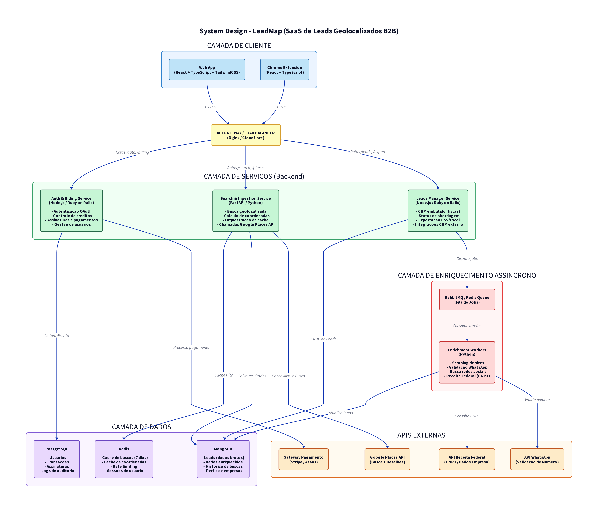

# Arquitetura Técnica e System Design: LeadMap

Este documento descreve a arquitetura de software, infraestrutura e modelagem de dados do **LeadMap**, projetada para suportar alta escalabilidade, processamento assíncrono e cache inteligente de dados de geolocalização, inspirada no ecossistema técnico do **Apollo.io** [1].

---

## 1. Diagrama de Arquitetura do Sistema

A arquitetura do LeadMap é dividida em 5 camadas principais para garantir baixo acoplamento, resiliência e facilidade de manutenção.

---

## 2. Detalhamento das Camadas

### 2.1. Camada de Cliente (Frontend)
- **Web App:** Desenvolvido em **React.js com TypeScript e TailwindCSS**, focado em uma interface rápida de página única (SPA).
- **Chrome Extension:** Desenvolvida em **React.js**, permitindo que o usuário capture e enriqueça leads diretamente enquanto navega no Google Maps ou sites de empresas.

### 2.2. Camada de API Gateway / Load Balancer
- Gerenciado via **Cloudflare / Nginx** para prover segurança (proteção contra ataques DDoS), SSL, roteamento de chamadas e controle de taxa de requisições (Rate Limiting) para evitar abusos na API.

### 2.3. Camada de Serviços (Backend)
Seguindo o modelo híbrido do Apollo.io, o backend divide as responsabilidades por serviços especializados [1]:
- **Auth & Billing Service (Node.js ou Ruby on Rails):** Gerencia autenticação de usuários (OAuth2, login social), controle de saldo de créditos, processamento de assinaturas recorrentes e faturamento.
- **Search & Ingestion Service (FastAPI / Python):** Serviço de alta performance responsável por receber requisições de busca geolocalizada, calcular coordenadas, gerenciar o cache no Redis e orquestrar chamadas para a API do Google Places.
- **Leads Manager Service (Node.js ou Ruby on Rails):** Responsável pela lógica de negócios do CRM básico (criação de listas, atualização de status de leads, anotações e exportação de relatórios em CSV/Excel).

### 2.4. Camada de Dados
- **PostgreSQL:** Banco de dados relacional para dados que exigem consistência transacional rígida (ACID), como contas de usuários, transações financeiras, assinaturas e logs de auditoria de créditos.
- **MongoDB:** Banco de dados NoSQL focado em documentos. Ideal para armazenar os dados brutos e enriquecidos dos leads, que possuem esquemas altamente flexíveis e dinâmicos (redes sociais, múltiplos telefones, e-mails, dados de CNPJ) [1].
- **Redis:** Banco de dados em memória utilizado para cache de requisições geográficas por 7 dias e cache de coordenadas. Reduz em até 60% as chamadas redundantes à API do Google, gerando enorme economia financeira.

### 2.5. Camada de Enriquecimento Assíncrono (Workers)
O enriquecimento de leads (descoberta de WhatsApp, scraping de sites e busca de CNPJ) é um processo pesado que ocorre em segundo plano:
- **RabbitMQ ou Redis Queue (RQ):** Fila de mensageria para gerenciar os jobs de enriquecimento em lote.
- **Enrichment Workers (Python):** Consumidores assíncronos que pegam os leads da fila, realizam scraping nos sites institucionais, validam se o número de telefone possui WhatsApp ativo e consultam dados de CNPJ na API da Receita Federal.

---

## 3. Fluxo de Dados: Busca e Enriquecimento

1. O usuário realiza uma busca por "Oficinas" em um raio de 10km de Curitiba.
2. O **Search Service** verifica se essa busca exata já existe no cache do **Redis**.
   - **Cache Hit (Existe):** Retorna os dados instantaneamente do Redis sem custo de API.
   - **Cache Miss (Não existe):** Dispara chamada para a **Google Places API**, salva os resultados básicos no **MongoDB** e no **Redis** (com expiração de 7 dias) e exibe na tela do usuário.
3. O usuário seleciona os leads que deseja e clica em "Desbloquear".
4. O sistema debita os créditos do usuário no **PostgreSQL** e dispara um job para a fila do **RabbitMQ**.
5. Os **Enrichment Workers** processam o lead de forma assíncrona:
   - Fazem scraping no site da empresa para buscar e-mails e links de redes sociais (Instagram).
   - Consultam a API do WhatsApp para verificar se o número de telefone celular é válido e ativo.
   - Consultam a API da Receita Federal para associar o CNPJ da empresa, se disponível.
6. Os dados enriquecidos são salvos no **MongoDB** e o usuário é notificado por e-mail ou visualiza os dados atualizados em tempo real no dashboard via WebSockets.

---

## Referências

[1]: https://www.apollo.io/tech-blog/building-apollos-data-machine-learning-platform "Building Apollo's Data & Machine Learning Platform"
