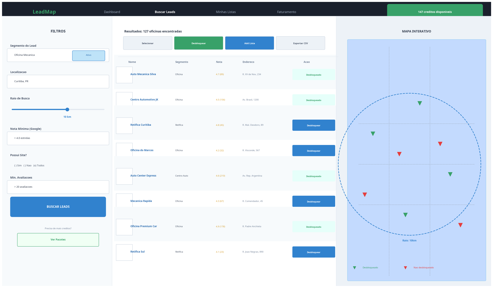
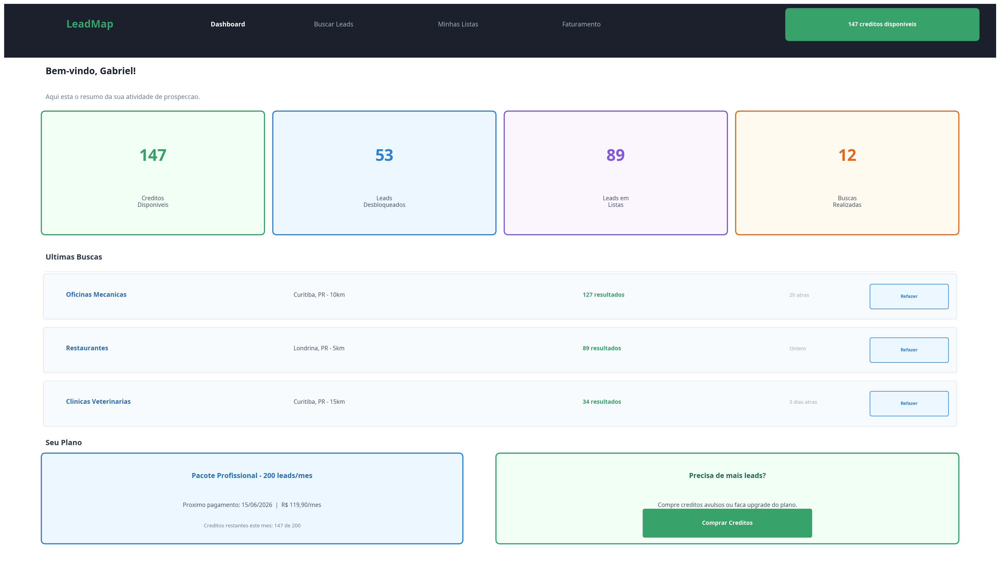
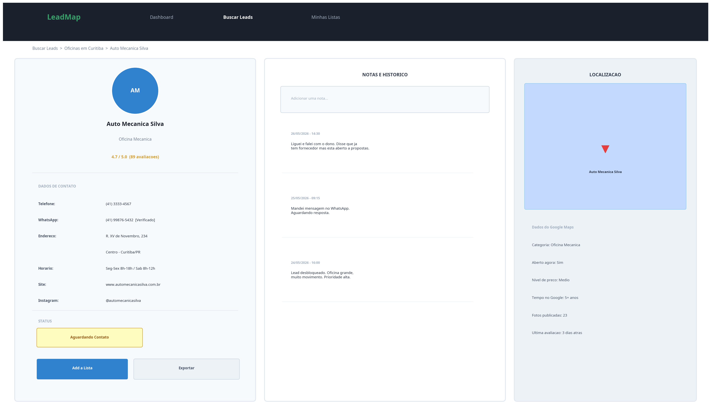

# System Design de UX/UI: LeadMap

Este documento detalha o design de interface (UI) e a experiência do usuário (UX) do **LeadMap**, inspirados na simplicidade e no foco em vendas do **Apollo.io** [1] [2].

---

## 1. Fluxo de Navegação e Mapa de Telas

O sistema foi desenhado para ser intuitivo e rápido. O usuário navega através de uma barra superior de abas (Header) e gerencia suas ações em painéis divididos.

```
[Login / Cadastro] 
       |
       v
[Dashboard (Painel Principal)] 
       |
       +---> [Buscar Leads (Módulo Central)] 
       |         |
       |         +---> Filtros (Esquerda)
       |         +---> Tabela de Leads (Centro)
       |         +---> Mapa Interativo (Direita)
       |
       +---> [Minhas Listas (CRM Simplificado)]
       |         |
       |         +---> Listas por Segmento/Região
       |         +---> Status de Abordagem (Kanban/Lista)
       |
       +---> [Faturamento & Planos]
                 |
                 +---> Saldo de Créditos
                 +---> Histórico de Consumo
```

---

## 2. Wireframes das Telas Principais

Para apoiar o desenvolvimento do frontend, foram criados wireframes conceituais que representam a disposição ideal dos elementos em tela.

### 2.1. Tela de Busca de Leads (Módulo Central)
Esta tela utiliza um layout de três colunas para permitir que o usuário filtre, visualize e mapeie os leads sem precisar mudar de página, maximizando a produtividade comercial.



*   **Painel de Filtros (Esquerda):** Entrada do segmento alvo, endereço/cidade de partida, controle de raio em KM via slider, nota mínima e quantidade de avaliações no Google.
*   **Tabela de Resultados (Centro):** Exibe a lista de empresas encontradas com botão de ação rápida "Desbloquear" para revelar os dados de contato consumindo 1 crédito.
*   **Mapa Interativo (Direita):** Integração com Google Maps exibindo pins verdes para leads desbloqueados e pins vermelhos para leads não desbloqueados, facilitando a visualização espacial da região.

### 2.2. Tela de Dashboard (Painel Geral)
O Dashboard oferece uma visão geral do progresso de prospecção do usuário e atalhos rápidos para retomar o trabalho.



*   **Cards de Métricas:** Exibição clara do saldo de créditos, total de leads desbloqueados, leads salvos em listas e quantidade de buscas realizadas.
*   **Últimas Buscas:** Lista das últimas consultas realizadas com atalho rápido "Refazer" para atualizar a busca na região com um clique.
*   **Controle de Assinatura:** Status do plano atual e botões para compra rápida de créditos adicionais.

### 2.3. Tela de Detalhes do Lead (CRM Embutido)
Ao clicar em um lead salvo, o usuário abre uma tela de detalhes rica para registrar o histórico de abordagem, espelhando a visualização de contatos do Apollo.io [1].



*   **Info do Lead (Esquerda):** Dados completos de contato (telefone, WhatsApp verificado, site, Instagram, endereço) e seletor de status de abordagem (ex: "Aguardando Contato", "Em Negociação", "Fechado").
*   **Notas e Histórico (Centro):** Campo para digitar anotações e timeline de interações com data e hora.
*   **Localização & Google Info (Direita):** Mini mapa mostrando o estabelecimento e dados adicionais extraídos do Google (fotos, categoria, horário de funcionamento).

---

## 3. Diretrizes de UI (Design System)

### Paleta de Cores
- **Cor Primária (Confiança e Tecnologia):** Azul Escuro (`#1A202C` a `#2B6CB0`) — usado no header, títulos principais e botões de ação secundária, alinhado à identidade visual do Apollo.io [1].
- **Ação Positiva / Sucesso:** Verde Esmeralda (`#38A169`) — usado para o botão "Desbloquear", saldo de créditos e status de sucesso.
- **Atenção / Alerta:** Laranja (`#DD6B20`) — usado para alertas de créditos baixos ou ações que exigem atenção.
- **Fundo da Aplicação:** Cinza Ultra Claro (`#F7FAFC`) — para contraste suave e redução da fadiga visual.

### Tipografia
- **Fonte Principal:** `Inter` (sans-serif) — excelente legibilidade para números, tabelas e dados densos de prospecção.

---

## Referências

[1]: https://www.apollo.io/ "Apollo.io — AI Sales Platform"
[2]: https://www.salesforge.ai/blog/apollo-io-review "Apollo.io Review: Is it still worth the hype in 2026?"
